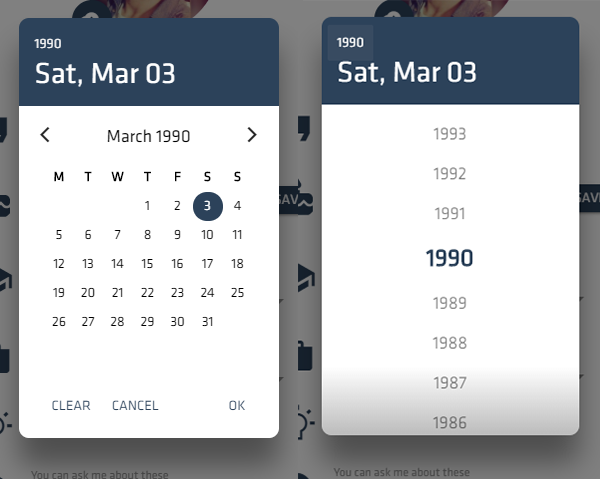
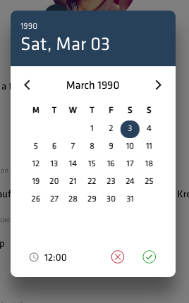

# Telexiom Datepicker / Datetime-Picker

### Datepicker



### Datetimepicker



- __Attention__: This Module requires an Ionic/Angular Project to function properly.

## Dependencies

- Ionic2-Calendar
- Intl
- moment

## Installation

1. Install these npm modules:

```bash
npm install --save ionic2-calendar moment intl
```

2. Add NgCalendarModule and LOCALE_ID to your app.module.ts:

```js
import { ErrorHandler, NgModule, LOCALE_ID } from '@angular/core';
import { IonicPageModule } from 'ionic-angular';
import { DatepickerPage } from './datepicker';
import { NgCalendarModule } from 'ionic2-calendar';
import { IonicErrorHandler } from 'ionic-angular';

@NgModule({
  declarations: [
    DatepickerPage,
  ],
  imports: [
    NgCalendarModule,
    IonicPageModule.forChild(DatepickerPage),
  ],
  providers: [
    { provide: LOCALE_ID, 
      useValue: 'en-GB' },
    {provide: ErrorHandler, useClass: IonicErrorHandler},
  ]
})
```

## Usage

### Open the Modal with the Ionic-Modalcontroller:

```js
    let modal = this.modalCtrl.create("DatepickerPage", {selectedDay: this.myDate, withTime: false}, {cssClass: 'settings-datepicker-modal'});
    modal.present();

    modal.onDidDismiss((data) => {
      if (data == 'clear') {
        this.myDate = '';
      } else if (data) {
        this.myDate = data;
      }
    });
```

- __Important__: The Pickers default cssClass should be __*settings-datepicker-modal*__, otherwise the Picker won't be displayed correctly!

### Following Data-Options are available for the Modal:

- __selectedDay__ *(moment Date, Optional)* : The starting Date / Datetime for the Picker. Default: *now*
- __withTime__ (*boolean*, Optional) : Set Picker Mode to Date (*false*) or Datetime (*true*). Default: *false*
- __minYear__ (*number*, Optional) : Set minimum year to pick in Year-Picker. Default: *now - 99 years*
- __maxYear__ (*number*, Optional) : Set maximum year to pick in Year-Picker. Default: *now*